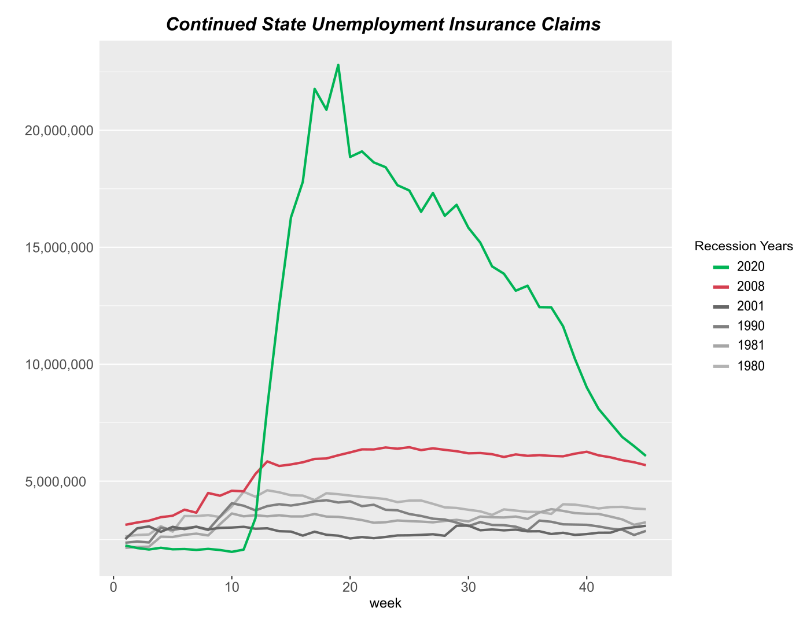
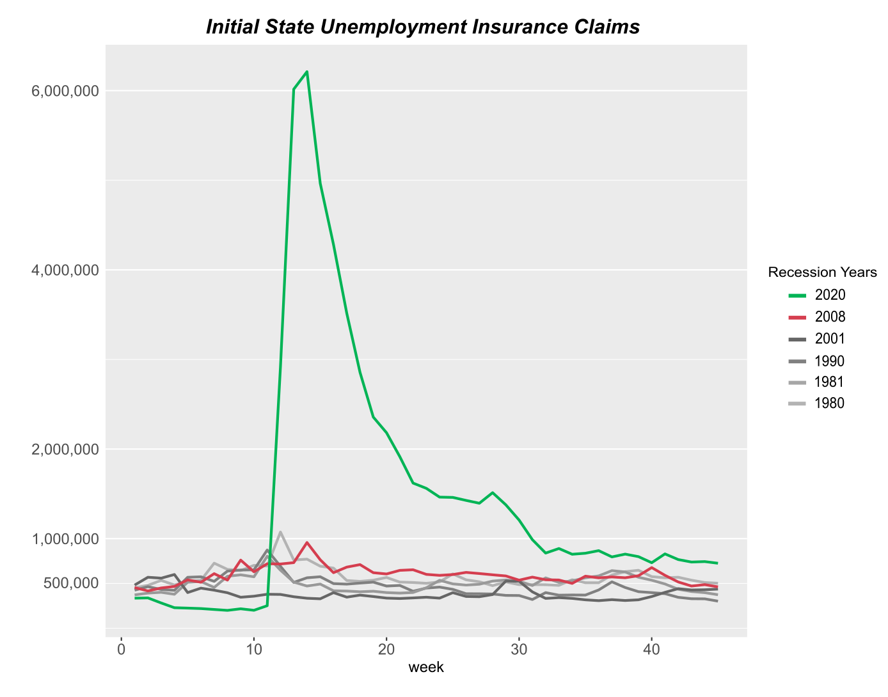
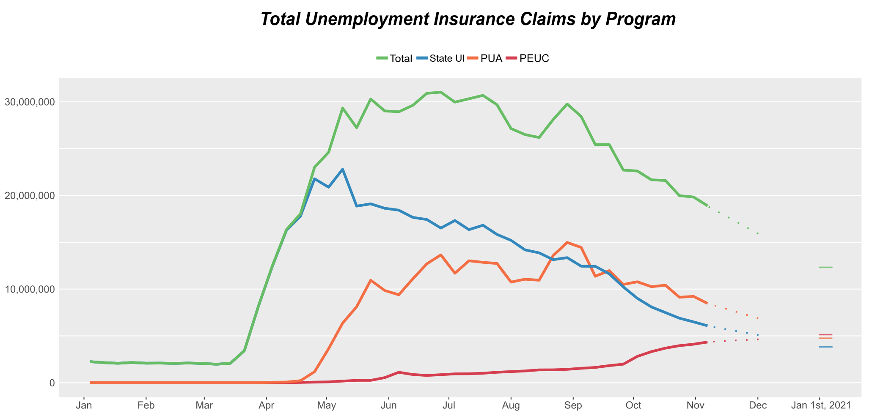
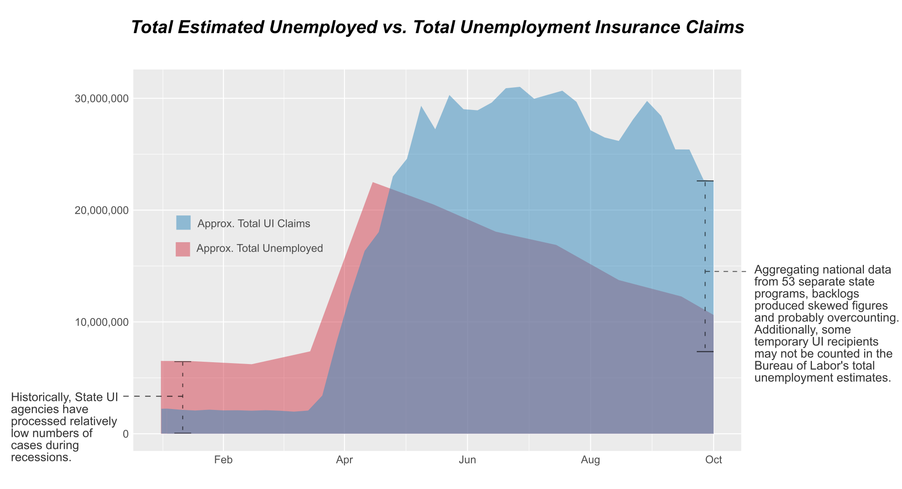
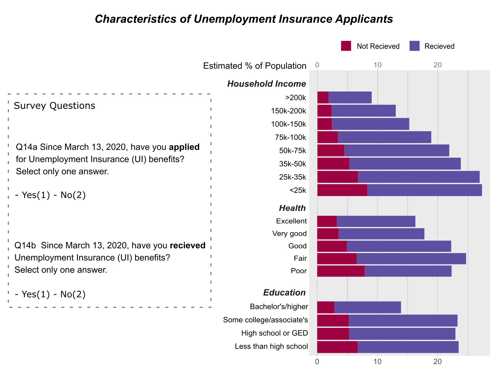
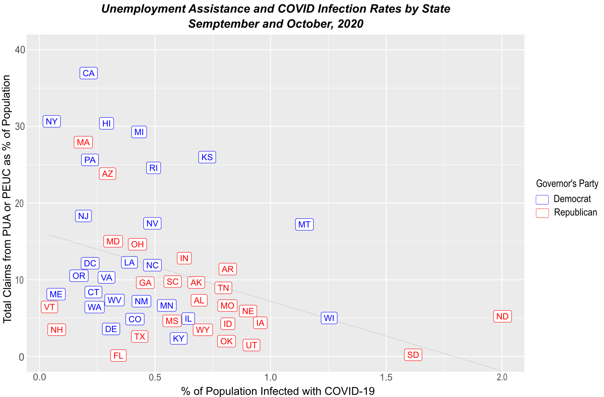
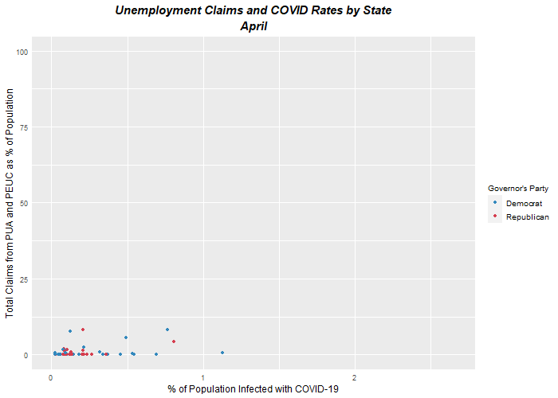
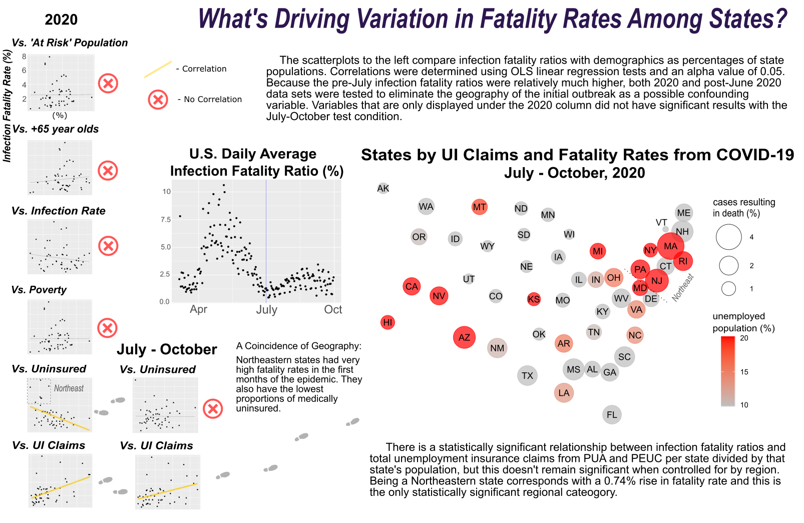

```{r setup, include=FALSE}
library(flexdashboard)
library(tidyverse)
library(readxl)
library(lubridate)
library(shiny)
library(gganimate)
library(gifski)
library(png)
library(maps)
library(RColorBrewer)


#setwd("C:/Users/David Chace/OneDrive/DOCUME~1-DESKTOP-R2S2BND-14/Data Analytics and Policy Courses/Data Visualization/Week 10 Shiny")

#state names and abbreviations
states <- tibble(state_name = state.name, state_abb = state.abb)

#State Population Table
state_pop <- readr::read_csv("nst-est2019-alldata.csv") %>% 
  select(st_code = STATE, state = NAME, pop_2019 = POPESTIMATE2019) %>% 
  slice(6:length(st_code)) %>% arrange(state) %>% select(-st_code) %>% 
  left_join(states, by = c('state'='state_name')) %>% 
  relocate(state_abb, .before = state) %>% 
  mutate(
    state_abb = case_when(
      state == 'District of Columbia' ~ 'DC',
      state == 'Puerto Rico' ~ 'PR',
      state == state ~ state_abb))

#COVID-19 cases table
covid_cases <- readr::read_csv('United_States_COVID-19_Cases_and_Deaths_by_State_over_Time (2).csv') %>%
  mutate(date = mdy(.$submission_date)) %>% 
  mutate(month = month(date)) %>%
  filter(month > 1) %>% 
  select(date, month, state_abb = state, new_case) %>% 
  left_join(state_pop, .,  by = 'state_abb') #left join to state pop. removes states not on state_pop's list

### governors and governor's political party
governors <- read_csv('us-governors.csv') %>% select(state_abb = state_code, state_name, party, name)
governors$party <- governors$party %>% str_to_title()

###total cases and death rate by date
plot_cases_by_date <- covid_cases %>% drop_na() %>% 
  mutate(month = month(date)) %>% 
  left_join(governors, ., by = c('state_name'='state', 'state_abb'='state_abb')) %>% 
  select(-name) %>% 
  group_by(month, state_abb) %>% 
  summarise(party = party, new_cases = sum(new_case)/pop_2019*100) %>% 
  unique() #factoring 'month' variable did not work in shiny

#PUA and PEUC by State
weekly_pandemic_claims <- readxl::read_xlsx("weekly_pandemic_claims (2).xlsx") %>% 
  rename(report_date = Rptdate, start_date = `Reflect Date`, PUA_IC = `PUA IC`, PUA_CC = `PUA CC`, PEUC_CC = `PEUC CC`) %>% 
  mutate(PUA_all = PUA_IC + PUA_CC + PEUC_CC, month = month(report_date)) %>% na.omit()

weekly_pandemic_claims <- weekly_pandemic_claims %>% select(State, month, report_date, start_date, PUA_all) %>% 
  filter(State != 'VI' & State != 'PR' & State != 'NA') %>% 
  group_by(month, State) %>% 
  summarise(PUA_all = sum(PUA_all)) %>% 
  left_join(., covid_cases, by = c('State' = 'state_abb', 'month')) %>% 
  mutate(PUA_all = PUA_all/pop_2019*100) %>% 
  left_join(., governors, by = c('State' = 'state_abb')) %>% 
  select(month, State, party, PUA_all)

#map data
library(maps)

map_48states <- map_data("state") %>% filter(region != "district of columbia")
map_48states$region <- str_to_title(map_48states$region)
map_48states <- map_48states %>% 
  left_join(., governors, by = c('region' = 'state_name')) %>% 
  select(-c(subregion, name))
map_48states$party <- str_to_title(map_48states$party)

states_centers <- as.data.frame(state.center)
states_centers$name <- state.name

map_cases_by_date <- covid_cases %>% drop_na() %>% 
  filter(state_abb != 'DC' & state_abb != 'PR') %>% 
  left_join(., states_centers, by = c('state'='name')) %>% 
  group_by(month, state_abb) %>% 
  summarise(new_cases = sum(new_case)/pop_2019*100, 
            x = x, y = y) %>% 
  unique() #factoring 'month' variable did not work in shiny

#Colors
dark_grey <- brewer.pal(9, "Greys")[7]
redorange <- brewer.pal(11, "Spectral")[2]
blue <- brewer.pal(11, "Spectral")[10]

```


Historical UI Applications {data-orientation=columns}
===================================== 

Column {data-width=250}
-------    
### Text

These timelines summarize why unemployment insurance (UI) has become a popular topic in news and public policy discussion since the COVID-19 pandemic. Current numbers of claims and beneficiaries are higher than at any point in U.S. history. The sheer number of claims that need processing has become a major challenge to the 53 state and territorial UI programs in the U.S. These figures do not include continued PUA and PEUC claims which are also processed by state and territorial programs. 

Figures represent claims not individuals who file claims. An individual can file more than one initial claim and beneficiaries must file continued claims each week that they continue to receive payments. Weekly total claims are displayed over a 45-week time period. 6 periods have been selected to represent the United States’ last 6 recessions’ high points in terms of UI claims. 

 
###### Source:

###### Employment and Training Administration, U.S. Department of Labor. (November 2020). Unemployment Insurance Data and Statistics- Unemployment Data Dashboard. *Weekly Claims and Extended Benefits Trigger Data* [.csv]. Retrieved from:  https://oui.doleta.gov/unemploy/DataDashboard.asp

Column {.tabset .tabset-fade data-width=750}
-------  

### Continued Claims

```{r}

```

### Initial Claims

```{r}

```
   
CARES Programs {data-orientation=columns}
=================

Column {data-width=150}
-------    
### Text

If Congress does not pass legislation extending the PUA (Pandemic Unemployment Assistance) and PEUC (Pandemic Emergency Unemployment Compensation) programs by Christmas, federal funding for the programs will expire on December 31st, 2020.  

Figures are based on continued claims only, so they represent individuals whose initial claims have been approved and who are applying for a continuation of benefits one week at a time. Projections for January 1st, 2020 are not based on models, however, the end point of the dotted lines are consistent with recently released data by the Employment and Training Administration at the U.S. Department of Labor. 

The PEUC is an extension of state UI benefits for those who have exhausted the 26 week limits set by most state UI programs. Consequently, the dip in continued claims for state UI mirrors the rise in PEUC claims. 


###### source: 

###### Employment and Training Administration, U.S. Department of Labor. (November 2020). Unemployment Insurance Data and Statistics- Unemployment Data Dashboard. *Weekly Claims and Extended Benefits Trigger Data* [.csv]. Retrieved from:  https://oui.doleta.gov/unemploy/DataDashboard.asp

###### Employment and Training Administration, U.S. Department of Labor. (November 2020). Unemployment Insurance Data and Statistics- Unemployment Data Dashboard. *Pandemic Unemployment Assistance Activities* [.csv]. Retrieved from:  https://oui.doleta.gov/unemploy/DataDashboard.asp
 

Column {data-width=850}
-------
### Unemployment Insurance Claims by Program
    
```{r}


```

Data Quality Issues {data-orientation=columns}
=======================================================================================

Column {data-width=250}
-------    
### Text

-  Total Unemployment vs Total UI Claims

This figure uses total unemployment estimates recently released by the Bureau of Labor Statistics. 
The total number of weekly UI claims is currently reported as being much higher than the estimated of total of unemployed labor force. This is likely due to problems in reporting and aggregation of state-level data. The upshot is that no one knows exactly how many individuals are currently receiving UI benefits from state, PUA and PEUC programs.

Historically, state UI programs have not been accustomed to processing such a high number of claims. Questions have been raised about the suitability of state UI programs’ hardware, staffing and data management systems as many approved beneficiaries have been reported to be waiting months for their first payments. These backlogs are likely to have skewed claims figures. Additionally, inconsistencies in reporting have likely caused errors as the Department of Labor has attempted to aggregate state agency data. The article below does a good job of elaborating these problems: 
https://www.nytimes.com/2020/09/16/business/economy/unemployment-claims-numbers.html

-  Characteristics of Claimants

This is from the Household Pulse Survey which has been taken from thousands of respondents every week since April, 2020 by the U.S. Census Bureau in order to develop timely indicators of the economic situation during COVID-19. It’s one of the few ways to look at the demographics of UI claimants. 

Responses from each sub-group have been remarkably consistent, changing within only 1-2 percentage points. Observing the survey questions printed in the visualization, however, there are no indicators as to whether those who reported that they applied for UI and have ‘not received’ benefits are either denied or waiting for payments. More data is needed to answer questions about vulnerable groups. 


###### Sources:

###### - Total Unemployment vs Total Unemplyment Insurance Claims
###### U.S. Bureau of Labor Statistics (November 2020). *Labor Force Statistics from the Current Population Survey*. Retrieved from: https://beta.bls.gov/dataViewer/view/timeseries/LNU03000000

##### Employment and Training Administration, U.S. Department of Labor. (November 2020). *Unemployment Insurance Data and Statistics- Unemployment Data Dasboard* [.csv]. Retrieved from:  https://oui.doleta.gov/unemploy/DataDashboard.asp

###### - Characteristics of Claimants
###### United States Census Bureau. (December 15, 2020). Household Pulse Survey Technical Documentation. [pdf] *2020 COVID-19 Household Pulse Survey Phase 2: In Field Beginning August*[pdf]. Retrieved from: https://www.census.gov/programs-surveys/household-pulse-survey/technical-documentation.html


Column{.tabset .tabset-fade data-width=750}
-------

### Total Unemployment vs Total Unemployment Insurance Claims

```{r}

```

### Characteristics of Claimants

```{r}

```

Infection Rate Summary
===================================================================================
Column {data-width=250}
-------    
### Text

These figures compare initial and continued PUA and PEUC UI claims with infections rates by state and the political parties of state governors. Because State UI data was not included in the ‘Total Claims’ variable, this variable may not be an accurate indicator of total UI beneficiaries per state. However, this is a close indicators of total numbers of individuals who are depending on federal funding per state. 

The negative correlation between infection rates and PUA/PEUC claimants means that states with higher infection rates are currently less likely to experience greater needs for federal UI assistance. This trend has been developing over time as shown in the animation. Observe the cluster of red states slowly moving away from blue states as months pass from the initial outbreak. 


###### Sources:

###### Centers for Disease Control and Prevention. (November 2020). Data.CDC.gov. COVID-19 Case Surveillance Public Use Data. Retrieved from: https://data.cdc.gov/Case-Surveillance/COVID-19-Case-Surveillance-Public-Use-Data/vbim-akqf

###### Employment and Training Administration, U.S. Department of Labor. (November 2020). Unemployment Insurance Data and Statistics- Unemployment Data Dashboard [.csv]. Retrieved from:  https://oui.doleta.gov/unemploy/DataDashboard.asp


Column{.tabset .tabset-fade data-width=750}
-------

### Sept & Oct

```{r}


```

### All Months- Animation
    
```{r}


```


Infection Rate Breakdown
====================================================================================

Input{.sidebar}
------
### Month

```{r}
 sliderInput("month_choice","", min = 2, max = 10, value = 3)

```

These figures use the same data as the ‘Infection Rate Summary’ section with the addition of national new case totals. Comparing the bar plots and map to national totals, one may observe that after the initial wave hit the Eastern seaboard states with Democrat governors, states with Republican governors quickly began to have a higher median infection rates and this has remained consistent as the largest outbreaks have moved from the Northeast, to the South and the Plains states. 

###### Sources:

###### Centers for Disease Control and Prevention. (November 2020). Data.CDC.gov. COVID-19 Case Surveillance Public Use Data. Retrieved from: https://data.cdc.gov/Case-Surveillance/COVID-19-Case-Surveillance-Public-Use-Data/vbim-akqf

###### Employment and Training Administration, U.S. Department of Labor. (November 2020). Unemployment Insurance Data and Statistics- Unemployment Data Dashboard [.csv]. Retrieved from:  https://oui.doleta.gov/unemploy/DataDashboard.asp


Column 1 {data-width=300}
------

### Unemployment Rate

```{r}
renderPlot(
  ggplot(data = filter(weekly_pandemic_claims, month == input$month_choice & is.na(party) != T), #choose month with input
       aes(x = party, y = PUA_all, fill = party))+ 
  geom_boxplot()+
  scale_fill_manual(values = alpha(c(blue, redorange), .6))+
  scale_y_continuous(limits = c(0, 75), breaks = c(0, 25, 50, 75)) + 
  labs(y = "% of state population")+
  ggtitle("Distributions of State-level\nPUA/PEUC Claims Rates by Party")+
  theme(plot.title = element_text(face = "bold.italic", size = 15, hjust = 0),
        axis.title.x = element_blank(),
        axis.title.y = element_text(size = 15),
        axis.text.y = element_text(size = 14),
        axis.text.x = element_blank(),
        axis.ticks.y = element_blank(),
        axis.ticks.x = element_blank(),
        legend.position = "none") 
)
```

### Infection Rate

```{r}
renderPlot(
     ggplot(data = filter(plot_cases_by_date, month == input$month_choice), #choose month with input
           aes(x = party, y = new_cases, fill = party))+ 
      geom_boxplot()+
      scale_fill_manual(values = alpha(c(blue, redorange), .6))+
      scale_y_continuous(limits = c(0, 2.5), breaks = c(0, 1, 2)) + #I don't know how to oob = squish the outliers
      labs(y = "% of state population")+
      ggtitle("Distributions of State-level\nInfection Rates by Party")+
      theme(plot.title = element_text(face = "bold.italic", size = 15, hjust = 0),
            axis.title.x = element_blank(),
            axis.title.y = element_text(size = 15),
            axis.text.y = element_text(size = 14),
            axis.text.x = element_blank(),
            axis.ticks.y = element_blank(),
            axis.ticks.x = element_blank(),
            legend.position = "none") 
)

```


Column 2 {data-width=700}
------

### New COVID Cases {data-height=300}

```{r}
renderPlot(
ggplot(data = covid_cases %>% group_by(date) %>% summarise(new_case = sum(new_case)) %>% mutate(month = month(date)),
       aes(x = date, y = new_case))+
  stat_smooth(
    geom = 'area', method = 'loess', span = 1/8,
    alpha = 3/4, fill = dark_grey)+
  scale_x_date(date_labels="%b", date_breaks  ="1 month")+
  ggtitle("Total New COVID-19 Cases by Day in the U.S.")+
  theme(plot.title = element_text(face = "bold.italic", size = 15, hjust = 0.1),
        axis.title.x = element_blank(),
        axis.text.x = element_text(size = 14),
        axis.ticks.x = element_blank(),
        axis.title.y = element_blank(), 
        axis.text.y = element_text(size = 14),
        axis.ticks.y = element_blank(),
        panel.grid.major.x = element_blank(),
        panel.grid.minor.x = element_blank(),
        legend.position = "top",
        legend.title = element_blank())+ 
  annotate("rect", xmin = as.Date(paste0('2020-', as.character(input$month_choice), '-01')), xmax = as.Date(paste0('2020-', as.character(input$month_choice + 1), '-01')), ymin = 0, ymax = 80000, alpha = .2)
)
```

### Map {data-height=700}

```{r}
renderPlot(
     ggplot(data = map_48states, mapping = aes(x = long, y = lat, group = group, fill = party, na.rm = T))+
      geom_polygon(color= 'black')+
      scale_fill_manual(values = alpha(c(blue, redorange), .6))+
      geom_point(data = map_cases_by_date %>% filter(state_abb != 'AK' & state_abb != 'HI') %>% 
                   filter(month == input$month_choice), #choose month with input
                 aes(x = x, y = y, size = new_cases), alpha = 0.6, inherit.aes = F)+
      scale_size(range = c(1, 15), breaks = c(.05,.1,.5,1,2,3), labels = c(.05,.1,.5,1,2,3),
                 limits = c(.05, 3))+ #How do I fix the num of breaks displayed? breaks= and labels= don't have any affect
      guides(size = guide_legend(order = 1, reverse = T), fill = guide_legend(order = 2))+
      labs(size = "% of state's total\n population infected", fill = "Governor's Party")+
      theme(plot.title = element_text(face = "bold.italic", size = 15, hjust = 0),
            panel.background = element_blank(),
            axis.title.x = element_blank(),
            axis.title.y = element_blank(), 
            axis.text.y = element_blank(),
            axis.text.x = element_blank(),
            axis.ticks.y = element_blank(),
            axis.ticks.x = element_blank(),
            legend.position = "right",
            legend.title = element_text(size = 15),
            legend.text = element_text(size = 14)) 
)

```


Fatality Rate
===============================================================================

Column{data-width=150}
-------
### Source Information

Apart from age and underlying health conditions, epidemiologists and policy makers want to know demographic and social factors associated with death rates. This knowledge can help us develop more targeted policy, but great efforts are required to develop useful data for hyptohesis testing. Here is an example of the inquery process using the Kaiser Foundation's state-level data from 2018 and the CDC's reporting of COVID-19 cases and deaths by state. The 'Infection Fatality Ratio' measures the proportion of all COVID-19 infections resulting in death.

These tests did not produce much insight on social factors associated with fatality ratios. Data from 2018 may vary too widely from current demographic make-ups and state-level demographics may not be granular enough to determine social drivers of fatalities, however, state-level aggregates will eventually be needed to prepare state and federal policy. This raises the question: are we doing enough to develop useful data in time to save lives? 

###### Sources:

###### Centers for Disease Control and Prevention. (November 2020). CDC COVID Data Tracker. United States COVID-19 Cases and Deaths by State. Retrieved from: https://covid.cdc.gov/covid-data-tracker/#cases_casesper100klast7days

###### Centers for Disease Control and Prevention. (November 2020). Data.CDC.gov. COVID-19 Case Surveillance Public Use Data. Retrieved from: https://data.cdc.gov/Case-Surveillance/COVID-19-Case-Surveillance-Public-Use-Data/vbim-akqf

###### Kaiser Family Foundation. (September 2020). How Many Adults are At-risk of Serious Illness if Infected with Coronavirus? Retrieved from: https://www.kff.org/global-health-policy/issue-brief/how-many-adults-are-at-risk-of-serious-illness-if-infected-with-coronavirus/

###### Kaiser Family Foundation. (September 2020). Status of State Medicaid Expansion Decisions: Interactive Map. Retrieved from: https://www.kff.org/medicaid/issue-brief/status-of-state-medicaid-expansion-decisions-interactive-map/

###### U.S. Census Bureau. (November 2020). Percentage of People in Poverty by State Using 2- and 3-Year Averages:  2016-2017 and 2018-2019. Retrieved from: https://www2.census.gov/programs-surveys/cps/techdocs/cpsmar20.pdf


Column
-------
### Infection Fatality Ratio
```{r}


```